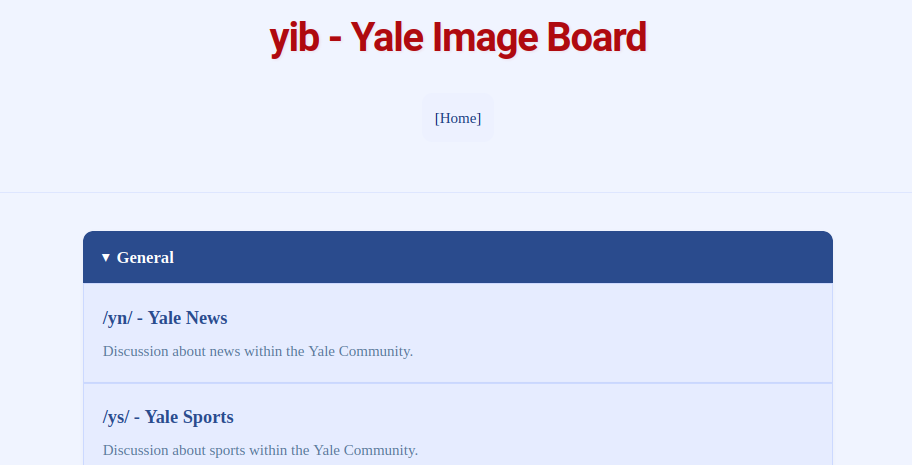
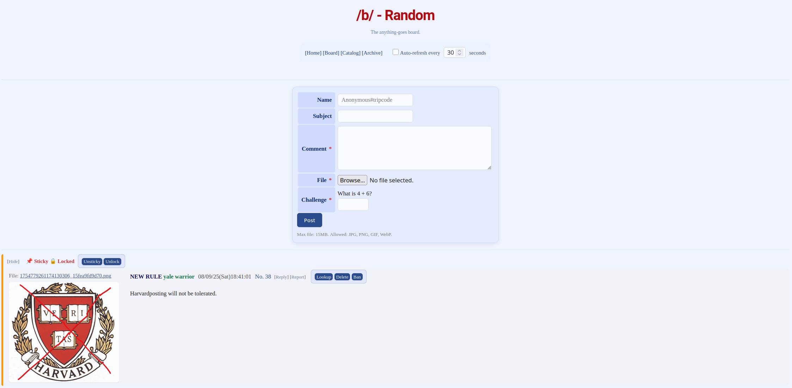

# yib - Yale Image Board

[](https://opensource.org/licenses/MIT)
[](https://github.com/ericsong1911/yib/releases/latest)

A classic-style, self-hosted imageboard project built with Go. `yib` is designed to be lightweight, secure, and feature-rich without relying on bulky frameworks.

**Note: `yib` is still in beta. Issues and bugs are to be expected.**





---

## Features

`yib` provides a complete imageboard experience for both users and administrators.

### User Features
*   **Classic Board/Thread/Reply Structure:** Familiar and intuitive imageboard layout.
*   **Image & WebP Support:** Upload JPG, PNG, GIF, and WebP files.
*   **Tripcodes:** Secure identitfication for anonymous users.
*   **Post Management:** Users can delete their own posts.
*   **Fast, Full-Text Search:** Powered by SQLite FTS5 for instant results.
*   **Post Previews:** Hover over a `>>` backlink to preview the post.
*   **Customization:** Multiple color schemes and client-side thread hiding.
*   **Protected Boards:** Boards can be password-protected.

### Moderation & Admin Features
A comprehensive moderation panel accessible only from the local network by default.
*   **Dashboard:** View recent posts and active reports at a glance.
*   **Post & Thread Management:** Delete any post, lock threads, and sticky threads.
*   **User Management:** Ban users by IP hash and/or cookie hash (temporary or permanent).
*   **Auditing:** Look up a user's entire post history by their IP or cookie hash. A persistent log records all moderator actions.
*   **Board & Category Management:** Create, edit, and delete boards and categories on the fly.
*   **Global Banner:** Post a site-wide announcement banner.

### Technical Features
*   **Secure by Default:** Built-in CSRF protection, automatic XSS prevention, and salted IP/cookie hashing.
*   **Performance:** Smart, batch-querying database logic to avoid N+1 problems.
*   **Self-Contained:** Single binary executable with no external runtime dependencies.
*   **Configurable:** Key settings like port and database path can be configured via environment variables.

---

## Getting Started

You can run `yib` either by downloading a pre-compiled release or by building from source.

### Option 1: From a Release (Recommended)

This is the easiest way to get started.

1.  Go to the [**Releases Page**](https://github.com/your-username/yib/releases/latest).
2.  Download the archive for your operating system and architecture (e.g., `yib-v1.0.0-linux-amd64.tar.gz`).
3.  Extract the archive:
    ```bash
    # For .tar.gz files
    tar -xzf yib-*.tar.gz
    
    # For .zip files, use your favorite unzip tool.
    ```
4.  Navigate into the extracted `release_package` directory and run the executable:
    ```bash
    cd release_package
    ./yib
    ```
5.  Your imageboard is now running! Open your browser to `http://localhost:8080`.

### Option 2: From Source

You will need Git and the Go toolchain (version 1.18 or later) installed.

1.  **Clone the repository:**
    ```bash
    git clone https://github.com/your-username/yib.git
    cd yib
    ```
2.  **Build the project:**
    The provided build script will format, bundle JavaScript, and compile the Go binary with all necessary build tags.
    ```bash
    chmod +x build.sh
    ./build.sh
    ```
3.  **Run the application:**
    ```bash
    ./yib
    ```
4.  Your imageboard is now running at `http://localhost:8080`.

---

## Configuration

`yib` can be configured using environment variables.

| Variable        | Description                              | Default                                         |
| --------------- | ---------------------------------------- | ----------------------------------------------- |
| `YIB_PORT`      | The port for the web server to listen on.| `8080`                                          |
| `YIB_DB_PATH`   | The path to the SQLite database file.    | `./yalie.db?_journal_mode=WAL&_foreign_keys=on` |

**Example:**
```bash
YIB_PORT=8888 YIB_DB_PATH=/var/data/myboard.db ./yib
```

## License

This project is licensed under the MIT License. See the [LICENSE](LICENSE) file for details.

## Acknowledgments

*   Thanks to the developers of Go, SQLite, and all the open-source libraries used.
*   Thanks to my friends who created themes, the favicon, and helped with bugtesting.